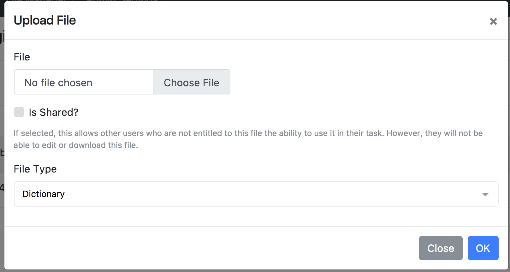

# First Run

## First Login

When GoCrack starts, depending on which authentication plugin you are using the following will happen:

1. If you're using the database plugin, an admin user will be created with the credentials `admin / ch@ng3me!`. You should change this immediately after logging in.
1. If you're using the LDAP plugin, the first user who logs into the system will automatically be promoted to admin.

## Uploading Engine Files

GoCrack tasks's wont function until "Engine Files" are uploaded. Engine files are dictionaries, mangling rules, and brute force masks used by the cracking engines to perform their task. From the `File Manager -> Engine Files` page, click the `Upload File` button.

Upload at least one dictionary and [password masks](https://hashcat.net/wiki/doku.php?id=mask_attack) file and select the appropriate type. In order for non-admins to use the file, you must check the `Shared` box. Non-admins will be able to select this file for tasks and see basic metadata about it but will be unable to edit/download the contents.
